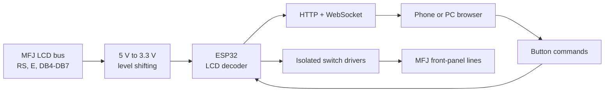

# MFJ-993B Remote Control

Unofficial ESP32-based LAN remote control and 16x2 LCD mirror for the MFJ-993B IntelliTuner.

The ESP32 observes the tuner's HD44780-compatible LCD bus, reconstructs DDRAM and dynamic CGRAM characters, serves a mobile-friendly web interface, and electrically emulates the nine front-panel controls through an external interface stage.

> **Project status:** experimental and hardware-specific. The current pin map and LCD sampling delay were tuned on one working installation. Verify every signal and voltage on your own hardware before connecting it.

## Features

- Live 16x2 LCD mirror in a browser, including dynamic CGRAM glyphs and bar graphs.
- Nine controls: ANT, C-UP, L-UP, AUTO, MODE, C-DN, L-DN, TUNE, and POWER.
- True press-and-hold operation for MODE, TUNE, and the C/L adjustment buttons.
- Manual-defined shortcuts and protected power-on service operations.
- Wi-Fi setup access point when no saved network can be reached.
- WebSocket transport with one requested LCD frame in flight, preventing a backlog of stale screens.
- Adaptive LCD requests: 25 ms normally and 100 ms while a momentary button is held.
- ArduinoOTA mode for later firmware uploads over the local network.

## How it works



The LCD capture loop runs on ESP32 core 1 at 240 MHz. A single GPIO register sample is taken 110 CPU cycles after E is observed high. Two 4-bit transfers are combined into one command or data byte. The decoder tracks visible DDRAM addresses, CGRAM address writes, entry direction, and the eight 5x8 custom characters.

The web task runs on core 0. The browser sends `L` only after the previous LCD packet has arrived. Button packets always take priority and are sent immediately. See [WebSocket protocol](docs/protocol.md).

## Repository layout

```text
firmware/MFJ993B_Remote_Control/MFJ993B_Remote_Control.ino  Main Arduino sketch
tools/LCD1602_CGRAM_Terminal_110/                           Serial LCD/CGRAM diagnostic sketch
docs/wiring.md                                             Wiring and electrical notes
docs/controls.md                                           Buttons and combinations
docs/protocol.md                                           LCD capture and WebSocket protocol
platformio.ini                                             Reproducible PlatformIO build
.github/workflows/build.yml                                Automatic build check
LICENSE                                                    MIT license
```

## Hardware

- Classic dual-core ESP32 development board with the required GPIOs exposed.
- 5 V to 3.3 V level shifting for all LCD signals read by the ESP32.
- An isolated/open-collector switch-emulation stage for the tuner controls.
- A stable regulated ESP32 supply. Do not feed 12-15 V directly into the ESP32.
- Common reference ground where required by the selected interface circuit.

The firmware pin map is summarized below. Full details are in [Wiring](docs/wiring.md).

| Function | ESP32 GPIO | Direction at ESP32 |
|---|---:|---|
| LCD E | 17 | Input |
| LCD RS | 4 | Input |
| LCD DB4 | 25 | Input |
| LCD DB5 | 18 | Input |
| LCD DB6 | 19 | Input |
| LCD DB7 | 23 | Input |
| ANT | 14 | Output to switch driver |
| C-UP | 26 | Output to switch driver |
| L-UP | 27 | Output to switch driver |
| AUTO | 33 | Output to switch driver |
| MODE | 13 | Output to switch driver |
| C-DN | 2 | Output to switch driver |
| L-DN | 5 | Output to switch driver |
| TUNE | 21 | Output to switch driver |
| POWER | 32 | Output, active-low in this build |

## Electrical and RF safety

**Do not connect the MFJ LCD bus directly to ESP32 GPIO.** The tuner schematic shows 5 V LCD logic, while Espressif specifies a 3.6 V GPIO tolerance. Use a proper level translator or resistor dividers on RS, E, and DB4-DB7.

Do not drive the tuner switch nets directly from push-pull ESP32 outputs. Use a correctly designed transistor, optocoupler, analog-switch, or relay interface that behaves like the original contacts and does not back-feed the MFJ logic.

Disconnect DC power, transmitter, and antennas before opening the tuner. Never work inside it while transmitting. The RF network can carry hazardous voltages and cause RF burns. Follow the warnings in the official MFJ manual.

## Build and first upload

1. Install [Arduino IDE](https://docs.arduino.cc/software/ide/) and the [Arduino core for ESP32](https://docs.espressif.com/projects/arduino-esp32/en/latest/installing.html).
2. Install [ESPAsyncWebServer](https://github.com/ESP32Async/ESPAsyncWebServer) and its ESP32 dependency [AsyncTCP](https://github.com/ESP32Async/AsyncTCP).
3. Open `firmware/MFJ993B_Remote_Control/MFJ993B_Remote_Control.ino`.
4. Select the matching classic ESP32 board and set the CPU frequency to 240 MHz.
5. Upload through USB. The sketch uses a Serial Monitor rate of 460800 baud.
6. If saved Wi-Fi credentials are absent or the connection fails, join `MFJ993b-CONFIG` with password `12345678`.
7. Open `http://192.168.4.1/`, enter the target Wi-Fi credentials, and wait for the ESP32 to restart.
8. Read the new LAN IP in Serial Monitor and open it in a browser.

### PlatformIO

[PlatformIO](https://docs.platformio.org/en/latest/core/index.html) users can build the same sketch from the repository root:

```bash
pio run
```

The checked-in environment pins the ESP32 platform, AsyncTCP, ESPAsyncWebServer, board type, monitor rate, and required 240 MHz CPU clock. GitHub Actions runs the same build on every push and pull request.

## Diagnostic sketch

`tools/LCD1602_CGRAM_Terminal_110/LCD1602_CGRAM_Terminal_110.ino` is a standalone serial sniffer used while tuning the capture timing. It prints stable DDRAM screens, active CGRAM slots and their 5x8 matrices, counters, address-space state, and sample differences. Sending `P` in Serial Monitor cycles the tuner's virtual POWER output OFF and ON so its LCD initialization and CGRAM definitions can be captured.

## OTA update

Click **System Update (OTA)** at the bottom of the web page and confirm. The ESP32 releases all momentary controls, stops normal LCD/web processing, and starts ArduinoOTA as:

- hostname: `MFJ-Remote`
- TCP port: `3232`
- authentication: none

Select the network port in Arduino IDE and upload the updated sketch. OTA is intended only for a trusted local network. If OTA mode is entered but no upload is performed, restart the ESP32 to return to normal operation.

## Security notes

The web controls, Wi-Fi configuration page, WebSocket commands, and OTA mode do not currently require authentication. Do not expose this device to the public Internet or an untrusted Wi-Fi network. Change the configuration AP password in the sketch before deployment.

## Official references

- [MFJ-993B product page](https://mfjenterprises.com/products/mfj-993b)
- [MFJ-993B instruction manual, version 2B (PDF)](https://cdn.shopify.com/s/files/1/0289/7782/3843/files/MFJ-993B.pdf?v=1586534115)
- [MFJ-991B/993B/994B/995 Rev. 2 schematic (PDF)](https://cdn.shopify.com/s/files/1/0289/7782/3843/files/MFJ-991B_993B_994B_Rev_2_Schematic.pdf?v=1586534155)
- [Arduino core for ESP32 documentation](https://docs.espressif.com/projects/arduino-esp32/en/latest/)
- [ArduinoOTA implementation in arduino-esp32](https://github.com/espressif/arduino-esp32/tree/master/libraries/ArduinoOTA)
- [Espressif GPIO voltage guidance](https://docs.espressif.com/projects/esp-faq/en/latest/hardware-related/hardware-design.html)
- [ESPAsyncWebServer](https://github.com/ESP32Async/ESPAsyncWebServer)
- [AsyncTCP](https://github.com/ESP32Async/AsyncTCP)

## License and trademarks

Project source and original documentation are released under the [MIT License](LICENSE).

MFJ, MFJ-993B, IntelliTuner, IntelliTune, InstantRecall, and other MFJ product names are trademarks of their respective owner. This is an independent community project and is not affiliated with or endorsed by MFJ Enterprises. The MFJ manuals and schematics are not redistributed here; the links above point to MFJ's official copies.

---

# MFJ-993B Remote Control — русский

Неофициальный сетевой пульт для антенного тюнера MFJ-993B на ESP32 с зеркалом штатного LCD 16x2 в браузере.

ESP32 пассивно считывает 4-битную шину LCD, восстанавливает обычные и пользовательские символы, поднимает локальную веб-страницу и через внешние ключи имитирует нажатия девяти кнопок передней панели.

> **Статус проекта:** экспериментальный и привязанный к конкретной аппаратной сборке. Распиновка и задержка выборки проверены на одном экземпляре. До подключения обязательно проверьте уровни и сигналы своего устройства.

## Возможности

- Живое зеркало LCD 16x2, включая CGRAM-символы и бегущие шкалы.
- ANT, C-UP, L-UP, AUTO, MODE, C-DN, L-DN, TUNE и POWER.
- Настоящее удержание MODE/TUNE/C/L без искусственного автоотпускания.
- Комбинации из руководства и защищённые подтверждением сервисные операции при включении.
- Режим точки доступа для первоначальной настройки Wi-Fi.
- WebSocket без очереди старых кадров: одновременно запрошен только один снимок LCD.
- Опрос LCD на веб-странице раз в 25 мс, при удержании кнопки — раз в 100 мс.
- Обновление прошивки по локальной сети через ArduinoOTA.

## Быстрый запуск

1. Установите [Arduino IDE](https://docs.arduino.cc/software/ide/) и [Arduino core for ESP32](https://docs.espressif.com/projects/arduino-esp32/en/latest/installing.html).
2. Установите библиотеки [ESPAsyncWebServer](https://github.com/ESP32Async/ESPAsyncWebServer) и [AsyncTCP](https://github.com/ESP32Async/AsyncTCP).
3. Откройте `firmware/MFJ993B_Remote_Control/MFJ993B_Remote_Control.ino`.
4. Выберите подходящую классическую ESP32 и частоту CPU 240 МГц.
5. Загрузите скетч по USB. Скорость Serial Monitor — 460800 бод.
6. Если ESP32 не подключилась к сохранённой сети, соединитесь с `MFJ993b-CONFIG`, пароль `12345678`.
7. Откройте `http://192.168.4.1/`, сохраните SSID и пароль домашней сети.
8. После перезапуска узнайте новый IP в Serial Monitor и откройте его в браузере.

Альтернативная сборка через PlatformIO выполняется из корня репозитория командой `pio run`. Версии платформы и библиотек зафиксированы в `platformio.ini`; GitHub Actions проверяет сборку при каждом изменении.

Диагностический скетч `tools/LCD1602_CGRAM_Terminal_110/LCD1602_CGRAM_Terminal_110.ino` выводит DDRAM/CGRAM и счётчики захвата в терминал. Команда `P` выполняет цикл POWER OFF → ON для перехвата инициализации дисплея.

## Важно по подключению

Штатный LCD работает от 5 В. Входы ESP32 не являются 5-вольтовыми — между LCD и ESP32 обязательно нужны преобразователи уровня или рассчитанные делители. Кнопочные GPIO также нельзя напрямую соединять с логическими цепями тюнера: необходимы ключи, имитирующие сухое замыкание контактов.

Подробная распиновка и требования к интерфейсу: [docs/wiring.md](docs/wiring.md). Кнопки и сочетания: [docs/controls.md](docs/controls.md). Формат обмена и устройство захвата LCD: [docs/protocol.md](docs/protocol.md).

## OTA и безопасность

Ссылка **System Update (OTA)** переводит контроллер в ArduinoOTA с именем `MFJ-Remote` и портом `3232`. Пароль OTA пока не задан. Веб-пульт также не имеет авторизации, поэтому устройство разрешено использовать только в доверенной локальной сети и нельзя публиковать в Интернет.

Проект распространяется по лицензии [MIT](LICENSE). Это независимая разработка, не связанная с MFJ Enterprises. Руководство и схема MFJ не копируются в репозиторий — используются только официальные ссылки из раздела выше.
