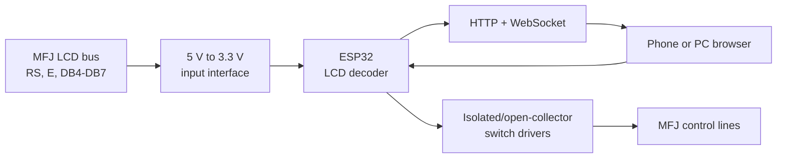

# MFJ-993B Remote Control

Unofficial ESP32-based LAN remote control and browser LCD mirror for the MFJ-993B IntelliTuner.

The ESP32 passively observes the tuner's 4-bit LCD bus, reconstructs the visible 16x2 screen and dynamic 5x8 custom characters, serves a mobile-friendly web interface, and controls the nine front-panel functions through an external switch-emulation stage.

> **Status:** experimental and hardware-specific. The pin map and LCD sampling point were tuned on one working installation. Verify signal levels, polarity and wiring on your own hardware before connecting it.

## Current features

- Browser mirror of the 16x2 LCD, including DDRAM, CGRAM glyphs and tuning bars.
- Stable main meter screen: frequency, `MHz`, SWR, `FWD=` and `REF=` are kept in fixed character cells.
- Main-screen numeric values are accepted independently, so a damaged bus byte does not shift the entire browser display or erase the last valid value.
- The three main-screen CGRAM indicators are updated only after two identical snapshots; partial glyph rewrites are not displayed.
- CGRAM activity does not delay frequency, SWR, forward-power or reflected-power updates.
- Nine controls: ANT, C-UP, L-UP, AUTO, MODE, C-DN, L-DN, TUNE and POWER.
- True press-and-hold behavior for MODE, TUNE and C/L adjustment buttons.
- Manual-defined shortcuts and confirmation-protected power-on service operations.
- Wi-Fi configuration access point when the saved network is unavailable.
- WebSocket request/response flow with no backlog of stale LCD frames.
- Browser polling every 20 ms normally and every 100 ms while a momentary control is held.
- Firmware upload from the browser at `/update` using the main `*.ino.bin` file.

## Architecture



The capture loop runs on ESP32 core 1 at 240 MHz. It samples `GPIO_IN_REG` 110 CPU cycles after LCD `E` is observed high and combines two 4-bit transfers into one command or data byte. The decoder tracks visible DDRAM addresses, CGRAM address writes, entry direction and all eight custom characters.

Networking and housekeeping run on core 0. The browser requests the next snapshot only after the previous response, so slow Wi-Fi or a VPN cannot build a queue of obsolete screens. Button commands are sent immediately.

The browser applies layout normalization only to the recognized `FWD=/REF=` meter screen. Tuning bars, L/C screens, Setup menus and service screens remain direct LCD copies.

## Repository layout

```text
firmware/MFJ993B_Remote_Control/MFJ993B_Remote_Control.ino  Main firmware
tools/LCD1602_CGRAM_Terminal_110/                           Serial diagnostic firmware
docs/wiring.md                                             Wiring and electrical safety
docs/controls.md                                           Buttons and combinations
docs/protocol.md                                           LCD capture and WebSocket protocol
docs/firmware-update.md                                    Browser firmware-update procedure
CHANGELOG.md                                                Notable firmware changes
platformio.ini                                             Reproducible PlatformIO build
.github/workflows/build.yml                                Automatic build check
LICENSE                                                    MIT license
```

## Pin map used by the firmware

### LCD inputs

| LCD signal | ESP32 GPIO |
|---|---:|
| E | 17 |
| RS | 4 |
| DB4 | 25 |
| DB5 | 18 |
| DB6 | 19 |
| DB7 | 23 |

### Control outputs

| Bit | Control | ESP32 GPIO | UI behavior |
|---:|---|---:|---|
| 0 | ANT | 14 | Latched |
| 1 | C-UP | 26 | Momentary/hold |
| 2 | L-UP | 27 | Momentary/hold |
| 3 | AUTO | 33 | Latched |
| 4 | MODE | 13 | Momentary/hold |
| 5 | C-DN | 2 | Momentary/hold |
| 6 | L-DN | 5 | Momentary/hold |
| 7 | TUNE | 21 | Momentary/hold |
| 8 | POWER | 32 | Latched; physical output is inverted |

See [Wiring](docs/wiring.md) before making any connection.

## Electrical and RF safety

**Do not connect a 5 V LCD signal directly to an ESP32 GPIO.** Use a suitable 5 V-to-3.3 V level translator or calculated resistor dividers on RS, E and DB4-DB7.

Do not connect push-pull ESP32 outputs directly to the tuner's switch nets. Use an appropriate optocoupler, transistor/open-collector, analog-switch or relay interface that behaves like the original contact and does not feed voltage back into either device.

Disconnect the transmitter, antennas and DC power before opening the tuner. Never work inside it while transmitting. Follow all warnings and service conditions in the MFJ manual.

## Arduino IDE build and initial USB upload

1. Install [Arduino IDE](https://www.arduino.cc/en/software).
2. Install the stable [Arduino core for ESP32](https://docs.espressif.com/projects/arduino-esp32/en/latest/installing.html) using Boards Manager.
3. Install these libraries using Library Manager:
   - [ESPAsyncWebServer](https://github.com/ESP32Async/ESPAsyncWebServer)
   - [AsyncTCP](https://github.com/ESP32Async/AsyncTCP)
4. Open `firmware/MFJ993B_Remote_Control/MFJ993B_Remote_Control.ino`.
5. Select the matching classic ESP32 board and a 240 MHz CPU frequency. The tested PlatformIO target is `esp32dev`.
6. Perform the first upload through USB. Serial Monitor speed is 460800 baud.
7. If the saved Wi-Fi cannot be reached, connect to `MFJ993b-CONFIG` with password `12345678`.
8. Open `http://192.168.4.1/`, enter the target Wi-Fi credentials and wait for restart.
9. Open the assigned LAN IP in a browser.

## Later firmware updates from the web page

The current firmware does **not** require an Arduino IDE network port, mDNS, UDP invitation or port 3232.

1. In Arduino IDE choose **Sketch → Export Compiled Binary**.
2. Open `http://<ESP-IP>/update` or click **Firmware Update (.bin)** on the control page.
3. Select only the main file ending in `.ino.bin`.
4. Do not select `bootloader.bin`, `partitions.bin` or a merged image.
5. Keep power and network connectivity until the progress reaches 100%. The ESP32 restarts automatically.
6. Reload the main page with `Ctrl+F5` if the browser retained an older embedded page.

The same HTTP method works through a routed VPN when the ESP32 address and TCP port 80 are reachable. Detailed instructions and file locations are in [Firmware update](docs/firmware-update.md).

## PlatformIO

From the repository root:

```bash
pio run
```

The environment pins:

- `espressif32@6.12.0`
- board `esp32dev`
- CPU frequency 240 MHz
- `ESP32Async/AsyncTCP@3.5.0`
- `ESP32Async/ESPAsyncWebServer@3.12.0`

The main image is generated as `.pio/build/esp32dev/firmware.bin`. GitHub Actions runs the same build on every push and pull request and publishes `MFJ993B_Remote_Control.ino.bin` as the `MFJ993B-Remote-Control-firmware` workflow artifact, ready for the browser update page.

## Diagnostic firmware

`tools/LCD1602_CGRAM_Terminal_110/LCD1602_CGRAM_Terminal_110.ino` is a standalone test sketch, not the normal web firmware. It prints captured DDRAM, active CGRAM slots, 5x8 matrices and diagnostic counters to Serial Monitor at 460800 baud. Sending `P` performs a controlled tuner POWER OFF → ON cycle to capture LCD initialization.

## Security

The control page, Wi-Fi configuration form, WebSocket and firmware-update page do not require authentication. Use this device only on a trusted LAN or trusted VPN. Do not expose TCP port 80 directly to the public Internet. Change the configuration AP password in the source before deployment.

## References

- [MFJ-993B product page](https://mfjenterprises.com/products/mfj-993b)
- [MFJ-993B instruction manual, version 2B (PDF)](https://cdn.shopify.com/s/files/1/0289/7782/3843/files/MFJ-993B.pdf?v=1586534115)
- [MFJ-991B/993B/994B/995 Rev. 2 schematic (PDF)](https://cdn.shopify.com/s/files/1/0289/7782/3843/files/MFJ-991B_993B_994B_Rev_2_Schematic.pdf?v=1586534155)
- [Arduino core for ESP32 documentation](https://docs.espressif.com/projects/arduino-esp32/en/latest/)
- [Espressif browser OTA update guide](https://docs.espressif.com/projects/arduino-esp32/en/latest/ota_web_update.html)
- [ESP32Async/ESPAsyncWebServer](https://github.com/ESP32Async/ESPAsyncWebServer)
- [ESP32Async/AsyncTCP](https://github.com/ESP32Async/AsyncTCP)
- [PlatformIO ESP32 Dev Module](https://docs.platformio.org/en/latest/boards/espressif32/esp32dev.html)

## License and trademarks

Project source and original documentation are released under the [MIT License](LICENSE).

MFJ, MFJ-993B, IntelliTuner and other MFJ product names are trademarks of their respective owner. This independent community project is not affiliated with or endorsed by MFJ Enterprises. MFJ manuals and schematics are not redistributed in this repository; the links above point to external copies.

---

# MFJ-993B Remote Control — русский

Неофициальный сетевой пульт для антенного тюнера MFJ-993B на ESP32 с зеркалом штатного LCD 16x2 в браузере.

ESP32 пассивно считывает шину дисплея, восстанавливает DDRAM и динамические символы CGRAM, отдаёт веб-интерфейс и через внешний ключевой каскад имитирует девять кнопок передней панели.

> **Статус:** экспериментальная прошивка для конкретной аппаратной сборки. Перед подключением обязательно проверьте уровни, полярность и распиновку своего устройства.

## Что работает

- LCD 16x2 в браузере, включая пользовательские символы и бегущие шкалы.
- На основном экране частота, `MHz`, КСВ, `FWD=` и `REF=` закреплены за постоянными знакоместами.
- Ошибочный байт не сдвигает весь основной экран и не стирает последнее корректное значение.
- Три CGRAM-значка основного экрана меняются только после двух одинаковых снимков; промежуточная построчная перерисовка не показывается.
- CGRAM больше не задерживает обновление частоты, КСВ, прямой и отражённой мощности.
- ANT, C-UP, L-UP, AUTO, MODE, C-DN, L-DN, TUNE и POWER.
- Удержание MODE/TUNE/C/L без программного автоотпускания.
- Дополнительные сочетания и сервисные операции при включении.
- Первичная настройка Wi-Fi через точку доступа.
- Один LCD-запрос в полёте — старые кадры не накапливаются даже через VPN.
- Опрос каждые 20 мс, при удержании кнопки — каждые 100 мс.
- Загрузка основной прошивки `.ino.bin` прямо из браузера через `/update`.

## Быстрый запуск

1. Установите [Arduino IDE](https://www.arduino.cc/en/software).
2. Через Boards Manager установите стабильный [Arduino core for ESP32](https://docs.espressif.com/projects/arduino-esp32/en/latest/installing.html).
3. Через Library Manager установите [ESPAsyncWebServer](https://github.com/ESP32Async/ESPAsyncWebServer) и [AsyncTCP](https://github.com/ESP32Async/AsyncTCP).
4. Откройте `firmware/MFJ993B_Remote_Control/MFJ993B_Remote_Control.ino`.
5. Выберите классическую ESP32 с частотой CPU 240 МГц и выполните первую прошивку по USB.
6. Если домашняя сеть недоступна, подключитесь к `MFJ993b-CONFIG`, пароль `12345678`.
7. Откройте `http://192.168.4.1/`, сохраните SSID и пароль сети.
8. После перезапуска откройте новый IP ESP32 в браузере.

## Обновление без USB

1. В Arduino IDE выберите **Скетч → Экспорт бинарного файла**.
2. На странице управления нажмите **Firmware Update (.bin)** либо откройте `http://<IP-ESP>/update`.
3. Выберите только основной файл `*.ino.bin`.
4. Не выбирайте `bootloader.bin`, `partitions.bin` и `merged.bin`.
5. Дождитесь 100% и автоматической перезагрузки ESP32.
6. После обновления страницы используйте `Ctrl+F5`, если браузер показывает старый интерфейс.

Сетевой порт Arduino IDE, mDNS и порт 3232 этой версии не нужны. Обновление выполняется обычным HTTP-запросом и может работать через маршрутизируемый VPN. Подробности: [docs/firmware-update.md](docs/firmware-update.md).

## Документация

- [Подключение и безопасность](docs/wiring.md)
- [Кнопки и сочетания](docs/controls.md)
- [Захват LCD и протокол WebSocket](docs/protocol.md)
- [Обновление прошивки через браузер](docs/firmware-update.md)

Диагностический скетч `tools/LCD1602_CGRAM_Terminal_110/LCD1602_CGRAM_Terminal_110.ino` является отдельной тестовой прошивкой без основного веб-пульта.

Веб-пульт, настройка Wi-Fi, WebSocket и страница обновления не имеют авторизации. Используйте устройство только в доверенной локальной сети или через доверенный VPN и не публикуйте TCP-порт 80 в Интернет.

Проект распространяется по лицензии [MIT](LICENSE) и не связан с MFJ Enterprises.
