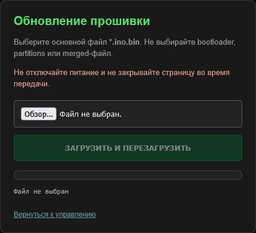

# Firmware update through the browser / Обновление через браузер

The current firmware receives its next application image over ordinary HTTP. Arduino IDE network-port discovery and port 3232 are not used.

Текущая прошивка принимает новый образ через обычный HTTP. Поиск сетевого порта в Arduino IDE и порт 3232 не используются.



## Requirements / Что требуется

- The ESP32 must already run a version containing the `/update` page.
- The computer must reach the ESP32 IP address on TCP port 80, directly or through a routed VPN.
- Use the application image produced for the same ESP32 board configuration.
- Keep power stable until upload and automatic restart are complete.

## Arduino IDE

1. Open `firmware/MFJ993B_Remote_Control/MFJ993B_Remote_Control.ino`.
2. Select the same ESP32 board and settings used for the installed firmware.
3. Choose **Sketch → Export Compiled Binary**.
4. Locate the main file ending in `.ino.bin`.

Typical project output:

```text
Windows:
C:\Users\<user>\Documents\Arduino\<sketch>\build\<board>\<sketch>.ino.bin

Linux:
~/Arduino/<sketch>/build/<board>/<sketch>.ino.bin
```

Arduino IDE versions may place an ordinary compile in a temporary directory. **Export Compiled Binary** is preferred because it creates a reusable image associated with the sketch. Espressif documents the same export step in its [OTA Web Update guide](https://docs.espressif.com/projects/arduino-esp32/en/latest/ota_web_update.html).

## PlatformIO

Build from the repository root:

```bash
pio run
```

The application image is:

```text
.pio/build/esp32dev/firmware.bin
```

The built-in upload page requires a filename ending in `.ino.bin`. When using the PlatformIO image, make a copy with such a name before selecting it, for example:

```bash
cp .pio/build/esp32dev/firmware.bin MFJ993B_Remote_Control.ino.bin
```

Renaming does not change the binary contents.

## Upload

1. Open the control page and click **Firmware Update (.bin)**, or open:

   ```text
   http://<ESP-IP>/update
   ```

2. Select the main application image ending in `.ino.bin`.
3. Confirm the upload.
4. Wait for 100%. Do not reload the page or remove power.
5. The ESP32 returns `OK. RESTARTING...` and restarts automatically.
6. Wait approximately 8-10 seconds and reload the main page.
7. Use `Ctrl+F5` if the old interface remains cached.

## Select the correct file

Use:

```text
<sketch>.ino.bin
```

Do not use:

```text
*.bootloader.bin
*.partitions.bin
*.merged.bin
bootloader.bin
partitions.bin
```

The browser validates the filename suffix before enabling the upload button. The ESP32 writes the received data to the application update partition and validates the completed image before restarting.

## VPN notes

HTTP upload does not depend on broadcast discovery or mDNS. If the control page opens through the VPN, the same routed connection can normally upload the firmware. A ping response alone is not sufficient: TCP port 80 must also be reachable and the VPN must allow the full upload connection.

Do not expose `/update` to the public Internet. It has no login, encryption or firmware signature verification beyond the ESP32 image validation performed by the update library.

## Recovery

- If the browser reports an error before 100%, leave the ESP32 powered and reopen the control page after 10 seconds.
- A failed upload should not replace the running application unless the image completes successfully.
- If the ESP32 no longer serves the web page, recovery requires physical USB access and a normal serial upload.
