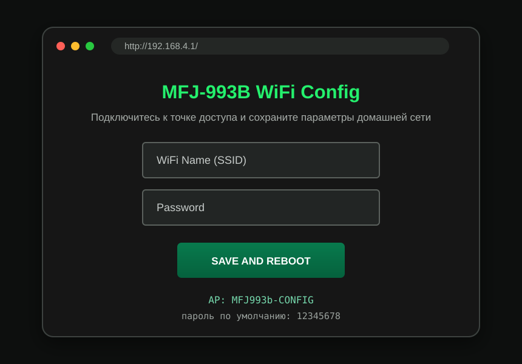

# Wi-Fi setup and recovery / Настройка и восстановление Wi-Fi

The ESP32 stores the target network SSID and password in non-volatile Preferences storage. After boot it tries the saved network for approximately 10 seconds. If there are no saved credentials or the network cannot be reached, it starts its own configuration access point.

ESP32 сохраняет SSID и пароль рабочей сети в энергонезависимой памяти Preferences. После включения устройство около 10 секунд пытается подключиться к сохранённой сети. Если настроек ещё нет либо сеть недоступна, автоматически запускается собственная точка доступа для настройки.

## Configuration access point

| Parameter | Default value |
|---|---|
| SSID | `MFJ993b-CONFIG` |
| Password | `12345678` |
| Page | `http://192.168.4.1/` |

1. Connect a phone or computer to `MFJ993b-CONFIG`.
2. Open `http://192.168.4.1/` in a browser. If the operating system reports that the access point has no Internet, remain connected.
3. Enter the SSID and password of the target Wi-Fi network.
4. Press **SAVE AND REBOOT**.
5. The ESP32 stores both values and restarts.
6. Reconnect the phone/computer to the normal network and open the new ESP32 address.

Если сохранённая сеть временно пропала, после очередной перезагрузки ESP32 также перейдёт в этот режим. Простое появление домашней сети не выводит устройство из уже запущенного режима точки доступа: сохраните параметры ещё раз либо перезагрузите ESP32, когда сеть снова доступна.

## Finding the new address

- Check the DHCP client list in the router or VPN-side router.
- Use the serial monitor at 460800 baud during boot; the firmware prints `IP: ...` after a successful connection.
- The current firmware does not rely on Arduino IDE network-port discovery, mDNS or UDP port 3232.

## Security

The configuration page is plain HTTP and has no login. Change the default access-point password in the source before deploying the device in an untrusted location. Do not expose the web interface directly to the public Internet.

Страница настройки работает по обычному HTTP и не имеет отдельной авторизации. Перед использованием в недоверенной среде замените стандартный пароль точки доступа в исходнике. Не публикуйте веб-интерфейс напрямую в Интернет.
