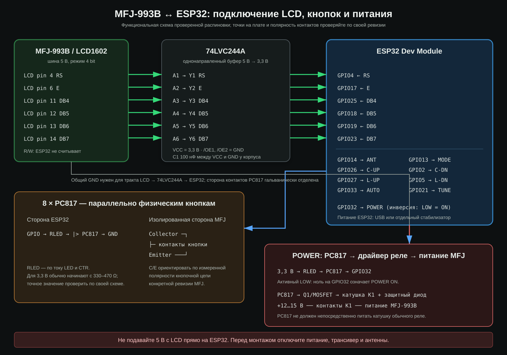

# Wiring / Подключение

This document records the pin assignment used by the current firmware. The working reference installation uses a 74LVC244A for LCD level translation, eight PC817 channels in parallel with the physical buttons, and a ninth isolated channel for the power-relay driver. It is not a universal MFJ-993B modification guide: board revisions and individual interface circuits may differ.

Здесь зафиксирована распиновка текущей прошивки. В проверенной сборке шина LCD поступает через 74LVC244A, восемь PC817 подключены параллельно физическим кнопкам, а девятая оптопара управляет драйвером реле питания. Это не универсальная инструкция по доработке MFJ-993B: ревизии плат и схемы развязки могут отличаться.

Measurements, interface behavior and component-level notes are documented in [Hardware implementation](hardware.md).

## LCD bus inputs / Входы шины LCD

The MFJ schematic identifies the display as a WH1602B-compatible 16x2 module using a 4-bit HD44780-style interface. The firmware does not sample R/W and assumes every captured transfer is a write; connect only RS, E and DB4-DB7 to the ESP32 input interface.

| LCD signal | LCD module pin | ESP32 GPIO | ESP32 mode | Notes |
|---|---:|---:|---|---|
| RS | 4 | 4 | INPUT | Command/data selection |
| E | 6 | 17 | INPUT_PULLDOWN | Enable sampling reference |
| DB4 | 11 | 25 | INPUT | Data bit 0 of each nibble |
| DB5 | 12 | 18 | INPUT | Data bit 1 of each nibble |
| DB6 | 13 | 19 | INPUT | Data bit 2 of each nibble |
| DB7 | 14 | 23 | INPUT | Data bit 3 of each nibble |
| GND/VSS | 1 | GND | — | Common reference, according to interface design |

DB0-DB3 are not used. The ESP32 does not drive the LCD. In the reference build the six observed lines pass through a 74LVC244A powered from 3.3 V; both `/OE` inputs are held low and a 100 nF bypass capacitor is fitted close to the IC.

DB0-DB3 не используются. ESP32 не управляет дисплеем. В проверенной сборке шесть линий проходят через 74LVC244A с питанием 3,3 В; оба входа `/OE` подключены к GND, возле микросхемы установлен блокировочный конденсатор 100 нФ.

Линия R/W прошивкой не считывается. Декодер считает каждый перехваченный обмен записью и использует только RS, E и DB4-DB7.

## Control outputs / Выходы кнопок

`BTN_PINS[]` defines the following order:

| Bit | Control | ESP32 GPIO | Firmware asserted level | UI behavior |
|---:|---|---:|---|---|
| 0 | ANT | 14 | HIGH | Latched ANT1/ANT2 state |
| 1 | C-UP | 26 | HIGH | Momentary, hold supported |
| 2 | L-UP | 27 | HIGH | Momentary, hold supported |
| 3 | AUTO | 33 | HIGH | Latched AUTO/MANUAL state |
| 4 | MODE | 13 | HIGH | Momentary, hold supported |
| 5 | C-DN | 2 | HIGH | Momentary, hold supported |
| 6 | L-DN | 5 | HIGH | Momentary, hold supported |
| 7 | TUNE | 21 | HIGH | Momentary, hold supported |
| 8 | POWER | 32 | **LOW** | Logical 1 = tuner ON; inverted physical output |

These are levels expected by the author's external switch-driver stage, not permission to wire ESP32 pins directly to MFJ nets. Every output should operate an interface that behaves like the corresponding physical contact. Confirm the required polarity with a meter before connecting the tuner.

Это уровни, рассчитанные на внешний каскад имитации контактов в авторской сборке. Они не означают, что GPIO можно напрямую соединять с цепями MFJ. Полярность каждого ключа необходимо проверить мультиметром до подключения тюнера.

## Reference signal path / Проверенная структура

The display path and the remote-control path are separate:

- `PIC16F76 → LCD1602 bus → 74LVC244A → ESP32 inputs`;
- `browser → ESP32 outputs → PC817 → physical button contacts`;
- `GPIO32 → PC817 → relay driver → power relay`.

The 74LVC244A is one-way; the ESP32 never sends data back to the LCD. Remote feedback is implemented through the isolated button and relay channels.

### LCD side

- Use the exact 74LVC244A or another translator explicitly rated for 5 V input with a 3.3 V powered output.
- Keep wires short. The firmware samples a fast digital bus and long unshielded leads may introduce ringing or timing errors.
- Do not leave unused buffer inputs floating.
- Use a common reference ground for LCD, 74LVC244A and ESP32 on the sensing path.

### Button side

- Connect each PC817 phototransistor electrically in parallel with the intended physical button, with collector/emitter orientation verified on the actual tuner board.
- Give every PC817 LED its own calculated series resistor; 330–470 Ω at 3.3 V is only a starting range.
- Do not inject 3.3 V into a tuner net and do not allow its pull-ups to reach the ESP32.
- Preserve the original front-panel buttons.
- Drive a conventional power-relay coil through a suitable transistor/MOSFET stage with a flyback diode, not directly from PC817.
- Check ANT/AUTO latching behavior and the active-low POWER output before attaching the tuner.

## Power supply / Питание

- The MFJ-993B requires 12-15 V DC; the ESP32 does not.
- Power the ESP32 from USB or a regulated buck converter appropriate for the board input.
- Use adequate local decoupling near the ESP32. Repeated `Brownout detector was triggered` messages indicate an unstable or insufficient ESP32 supply, not an LCD parser fault.
- Avoid rapid MFJ power cycling. The MFJ manual warns that it can corrupt tuning memory.

## RF safety

Disconnect the transmitter, antennas, and DC supply before opening the MFJ-993B. Do not test internal wiring while RF is applied. Refer to the official [MFJ-993B manual](https://cdn.shopify.com/s/files/1/0289/7782/3843/files/MFJ-993B.pdf?v=1586534115) and [Rev. 2 schematic](https://cdn.shopify.com/s/files/1/0289/7782/3843/files/MFJ-991B_993B_994B_Rev_2_Schematic.pdf?v=1586534155).

Перед вскрытием отключите передатчик, антенны и питание MFJ-993B. Не проверяйте внутренний монтаж при подаче RF.
